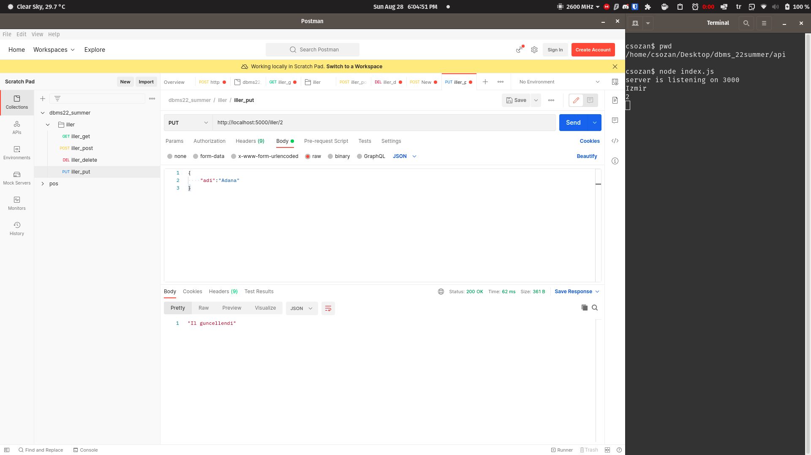

# API Dökümantasyonu (Ozan Çakmak)

Uygulamada CRUD operasyonları yapılabilmesi için bir RESTfull APİ’si yazdım. Bunu
NodeJS ve ExpressJS kullanarak JavaScript ile yazdım. Uygulama kaynak kodların
içerisindeki index.js’nin node komutuna birincil argüman olarak gönderilmesi ile çalışır.
Node komutu nodejs serverini çalıştırmakta kullanılan bir komut satırı uygulamasıdır. API’nin
genel olarak kullanımı şöyledir:

### **/ipofserver:5000/tablename**

- Buraya **POST** ile erişerek istediğiniz tabloya satır ekleyebilirsiniz. Eklemek istediğiniz
verileri json formatında göndermeniz gerekir.
- Buraya **GET** ile erişerek istediğiniz tablonun içeriklerini sorgulayabilirsiniz.

### **/ipofserver:5000/tablename:id**

- Buraya **GET** ile erişerek ve istediğiniz ID yi vermeniz koşuluyla istediğiniz tablonun
belirli ID’li satırına ulaşabilirsiniz
- Buraya **PUT** ile erişerek istediğiniz tablonun istediğiniz satırında güncelleme
yapabilirsiniz. Verilerinizi json formatında göndermeniz gerekmektedir
- Buraya **DELETE** ile erişirseniz istediğiniz tablonun istediğiniz satırını silebilirsiniz

### **/ipofserver:5000/f/functionname**

- Buradan seçtiğiniz gömülü fonksiyonu kullanabilirsiniz
- Kullanacağınız fonksiyon **IlSil** ise **ilsil/id** ile sectiğin id üzerinde işlem uygulayabilirsiniz
- functionname yerine yazılacak string’i fonksiyon tanıtımlarında görebilirsiniz

## Uygulama

### GET

### POST

### GET AFTER POST

### PUT

### GET AFTER PUT

### DELETE

### GET AFTER DELETE
